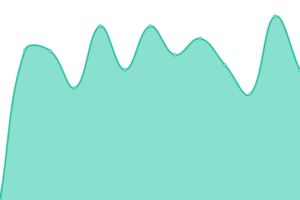

# [📈 Live Status](https://demo.upptime.js.org): <!--live status--> **🟥 Complete outage**

This repository contains the open-source uptime monitor and status page for [Vaughan Agrez](https://demo.upptime.js.org), powered by [Upptime](https://github.com/upptime/upptime).

With [Upptime](https://upptime.js.org), you can get your own unlimited and free uptime monitor and status page, powered entirely by a GitHub repository. We use [Issues](https://github.com/agrez/upptime/issues) as incident reports, [Actions](https://github.com/agrez/upptime/actions) as uptime monitors, and [Pages](https://demo.upptime.js.org) for the status page.

<!--start: status pages-->
<!-- This summary is generated by Upptime (https://github.com/upptime/upptime) -->
<!-- Do not edit this manually, your changes will be overwritten -->
<!-- prettier-ignore -->
| URL | Status | History | Response Time | Uptime |
| --- | ------ | ------- | ------------- | ------ |
|  [SIHE Mail](https://mail.sheridan.edu.au) | 🟥 Down | [sihe-mail.yml](https://github.com/agrez/upptime/commits/HEAD/history/sihe-mail.yml) | 

 1649ms
     
 | 

<a href="https://agrez.github.io/upptime/history/sihe-mail">98.03%</a>
    

|  [SIHE Website](https://www.sheridan.edu.au) | 🟥 Down | [sihe-website.yml](https://github.com/agrez/upptime/commits/HEAD/history/sihe-website.yml) | 

 2091ms
     
 | 

<a href="https://agrez.github.io/upptime/history/sihe-website">98.05%</a>
    

|  [SIHE Canvas](https://canvas.sheridan.edu.au) | 🟥 Down | [sihe-canvas.yml](https://github.com/agrez/upptime/commits/HEAD/history/sihe-canvas.yml) | 

 2016ms
     
 | 

<a href="https://agrez.github.io/upptime/history/sihe-canvas">97.54%</a>
    

|  [SIHE UMS](https://student.sheridan.edu.au) | 🟥 Down | [sihe-ums.yml](https://github.com/agrez/upptime/commits/HEAD/history/sihe-ums.yml) | 

 1368ms
     
 | 

<a href="https://agrez.github.io/upptime/history/sihe-ums">98.11%</a>
    

|  [SIHE Library](https://library.sheridan.edu.au) | 🟥 Down | [sihe-library.yml](https://github.com/agrez/upptime/commits/HEAD/history/sihe-library.yml) | 

 3709ms
     
 | 

<a href="https://agrez.github.io/upptime/history/sihe-library">2.77%</a>
    

<!--end: status pages-->

[**Visit our status website →**](https://demo.upptime.js.org)

## 📄 License

- Powered by: [Upptime](https://github.com/upptime/upptime)
- Code: [MIT](./LICENSE) © [Vaughan Agrez](https://demo.upptime.js.org)
- Data in the `./history` directory: [Open Database License](https://opendatacommons.org/licenses/odbl/1-0/)
